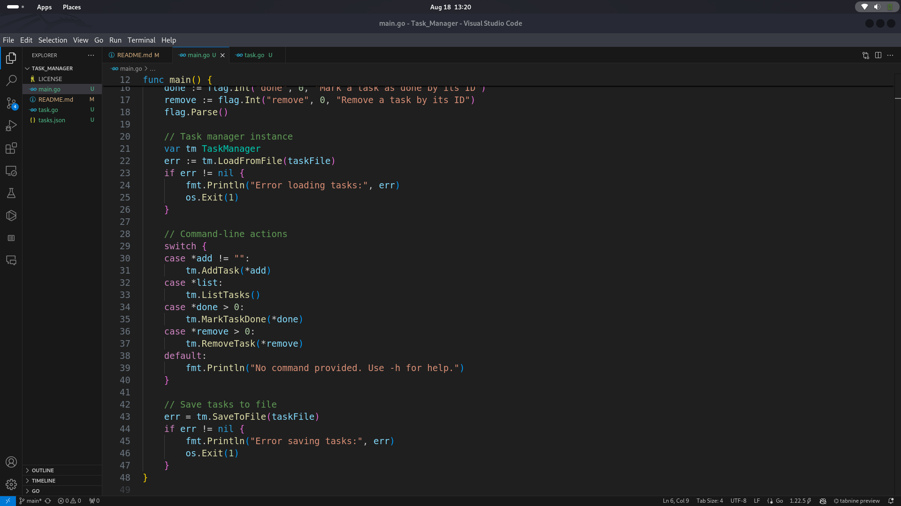
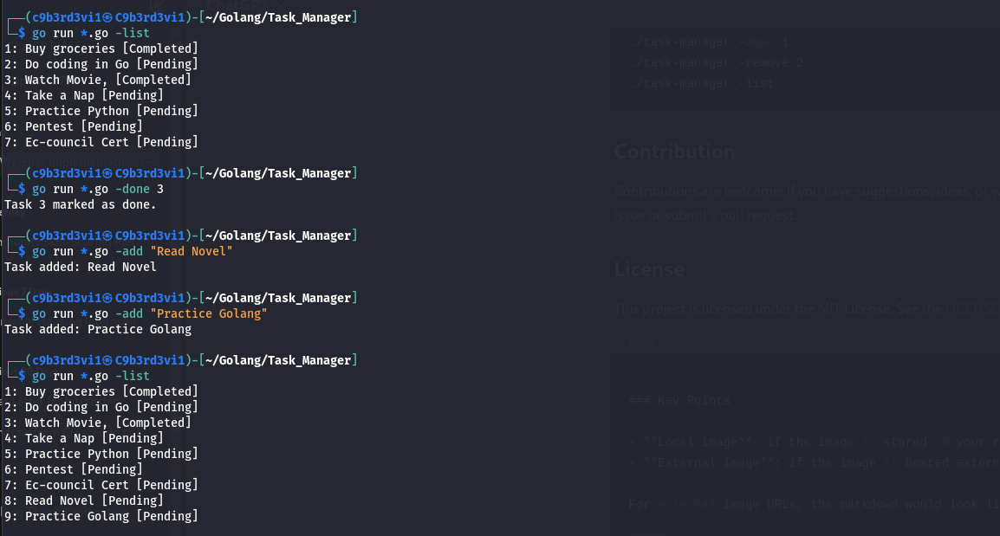
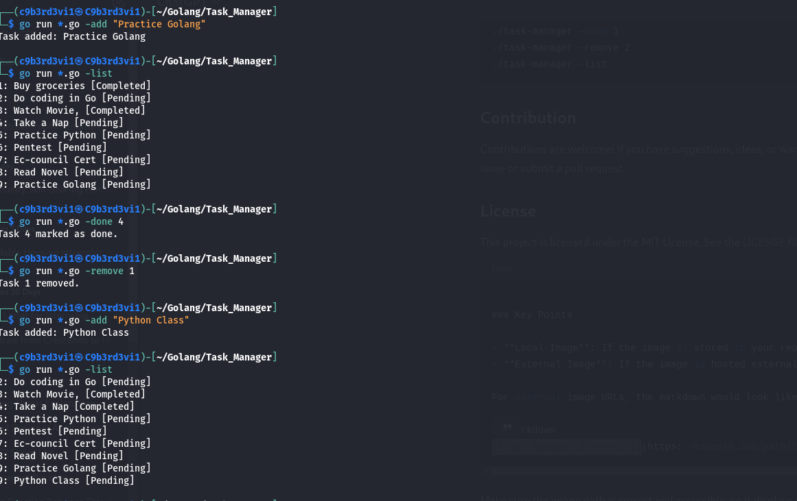

# Task_Manager

A simple design and implementation for a CLI Task Manager in Go,

# CLI Task Manager

A simple command-line tool written in Go to manage daily tasks. This tool allows you to add, list, mark as done, and remove tasks, all from your terminal. Tasks are saved to a JSON file, so your list persists between sessions.

## Features

- **Add Task**: Add a new task with the `-add` flag.
- **List Tasks**: List all tasks with the `-list` flag.
- **Mark Task as Done**: Mark a task as completed with the `-done` flag followed by the task ID.
- **Remove Task**: Remove a task with the `-remove` flag followed by the task ID.
- **Save and Load**: Tasks are automatically saved to and loaded from a `tasks.json` file.

## Installation

1. **Clone the repository**:

    ```bash
    git clone https://github.com/C9b3rD3vi1/Task_Manager.git
    
    cd Task_Manager
    ```

2. **Build the project**:

    ```bash
    go build -o Task_Manager
    ```

3. **Run the tool**:

    After building, you can run the tool using:

    ```bash

    ./go ru *.go -add "Buy groceries"
    ./go ru *.go  -list
    ./go run *.go  -done 1
    ./go run *.go  -remove 1
    ```

## Usage

### Add a Task

```bash
./go run *.go  -add "Your task description"


List All Tasks

./go run *.go  -list


Mark a Task as Done

./go run *.go  -done [task_id]


Remove a Task

./go run *.go  -remove [task_id]


Help
You can get help by running:

./go run *.go  -h


## Example

./go run *.go  -add "Complete Go project"
./go run *.go  -add "Read a book"
./go run *.go  -list
./go run *.go  -done 1
./go run *.go  -remove 2
./go run *.go  -list


## Contribution
Contributions are welcome! If you have suggestions, ideas, or want to report a bug, please open an issue or submit a pull request.

## License
This project is licensed under the MIT !License. See the LICENSE file for details.


# Project working samples image




# Terminal Image output



